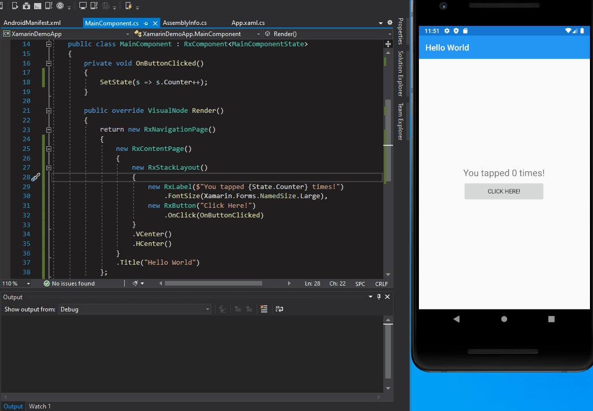
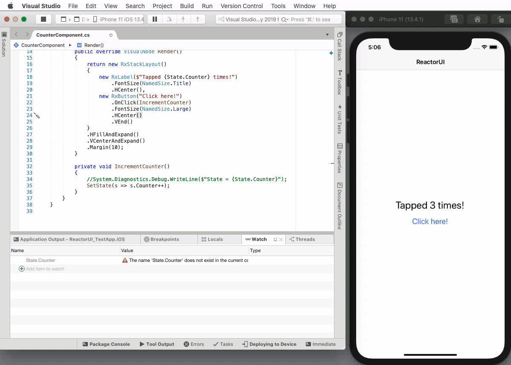
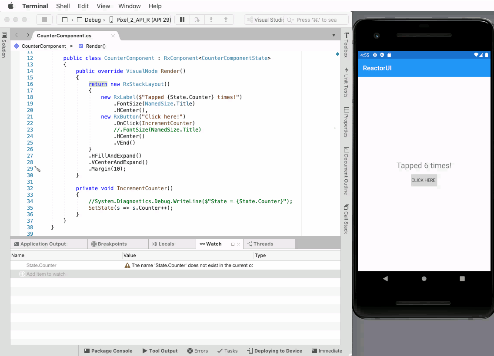

# ReactorUI for Xamarin Forms

ReactorUI is an alternative UI framework written on top of Xamarin Forms highly inspired to React.js and Flutter

:tada: **UPDATED TO XAMARIN FORMS 5** :tada:

[ReactorUI for Xamarin Documentation](https://adospace.gitbook.io/reactorui/)

 

## Main Features
* Component based UI with state management (similar to React.js or Flutter)
* Very fast hot reload even when debugging
* Completely integrated with Visual Studio 2019 and Visual Studio for Mac 2019 (no need to install or lunch external servers) ([Install the Extension](https://adospace.gitbook.io/reactorui/guide/setting-up))

### Visual Studio 2019 (Android)

### Visual Studio for Mac 2019 (iOS)

### Visual Studio for Mac 2019 (Android)

## Samples
This repository contains many samples of ReactorUI components: I'm heavily working on them adding new ones every week.

Furthermore I've opened a new repository that shows how to implement a fully working app: please take a look https://github.com/adospace/reactorui-xamarin-realworld

## Video Tutorials
In the following 3 parts video, I'll show how create a sample Calculator app in ReactorUI for Xamarin Forms: You can get a deeper look at how to create statefull components, how react to state changes and modify visual tree accordinly. 

Furthermore you'll learn how create an adaptative layout and react to landscape/poirtrat mode change event.

* PART 1 (15 min) https://www.youtube.com/watch?v=77vpONQFJCE&t=44s
* PART 2 (15 min) https://www.youtube.com/watch?v=wZPDe3k3_pY
* PART 3 (8 min) https://www.youtube.com/watch?v=RBfixSZnaF0&t=324s
