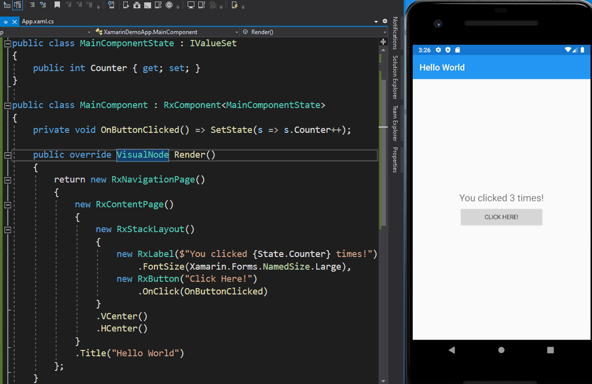

# ReactorUI for Xamarin Forms

ReactorUI is an alternative UI framework written on top of Xamarin Forms highly inspired to React.js and Flutter:

## Main Features
* Component based UI (much similar to React.js or Flutter) with state management
* Very fast hot reload even when debugging
* Completely integrated with Visual Studio 2019 (no need to install or lunch external servers) ([download the VS extension](https://marketplace.visualstudio.com/items?itemName=adospace.ReactorUI-Xamarin))

 

[ReactorUI for Xamarin Documentation](https://adospace.gitbook.io/reactorui/)

